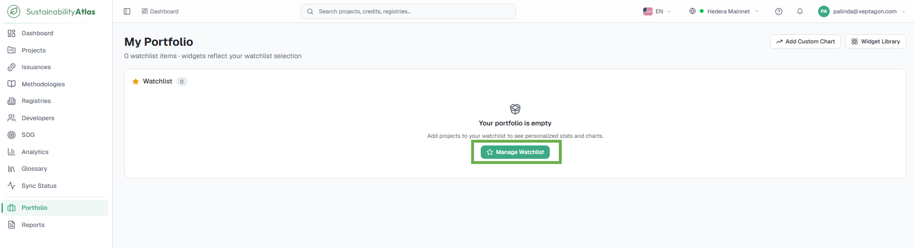
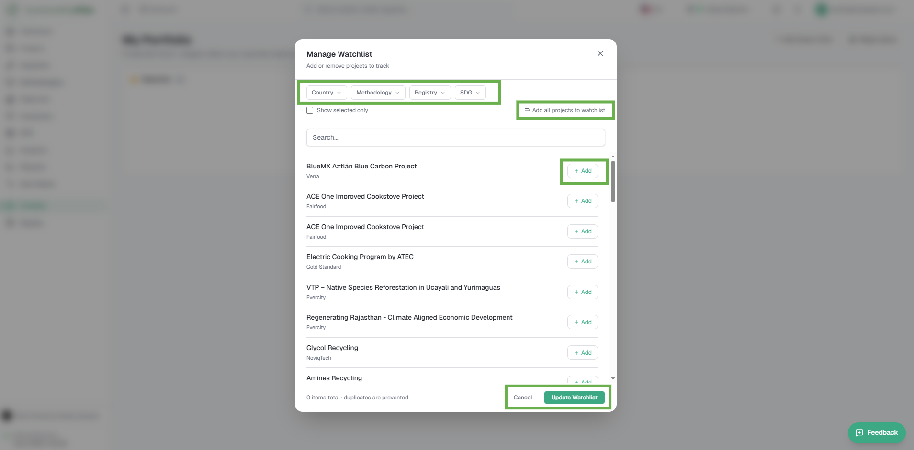
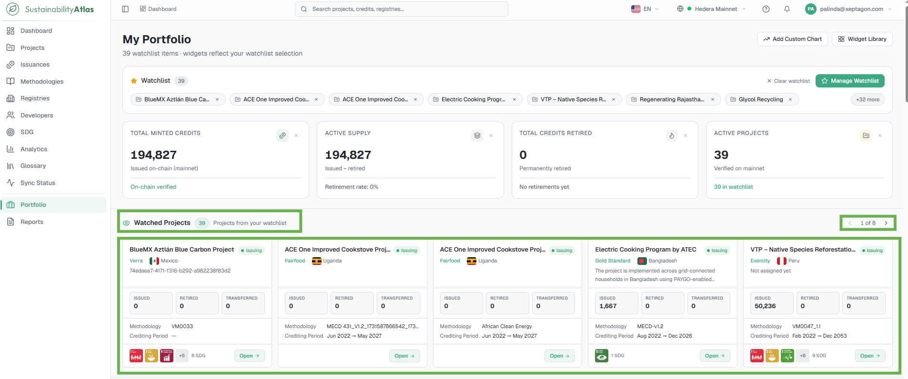
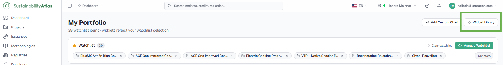
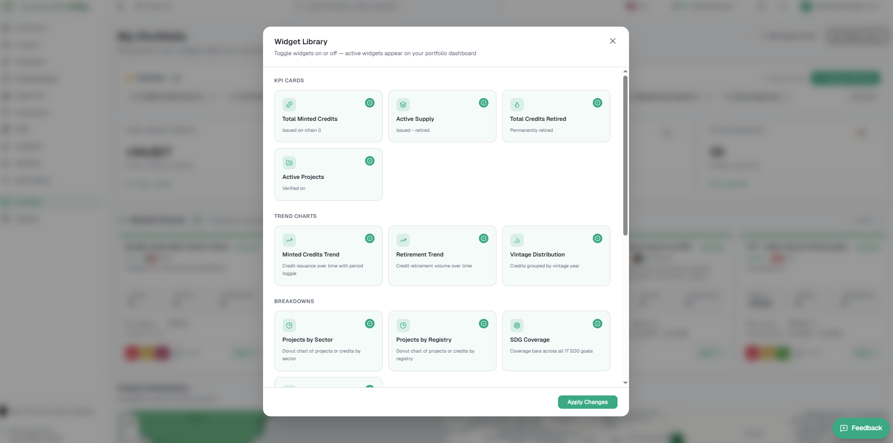
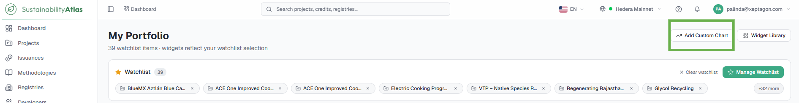
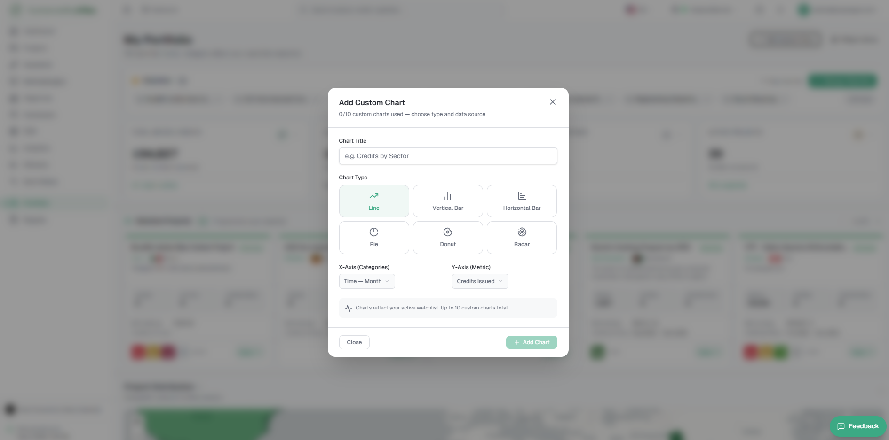

# 09 — Portfolio

The Portfolio is a private, personalized workspace that allows users to monitor the projects, methodologies, and credits they are interested in. Unlike the other pages in the Sustainability Atlas, which display data from across the entire network, the Portfolio displays only the items the user has chosen to follow through their Watchlist. It requires a signed-in account.

Everything on this page is private to the signed-in user. Managing the watchlist, adding or removing widgets, or creating custom charts does not modify any project data or affect what other users see.

## Starting from an empty Portfolio

A new account begins with an empty Portfolio. Until projects are added to the watchlist, the dashboard contains no portfolio data to summarize. Users populate their Portfolio by selecting **Manage Watchlist** and adding one or more projects; once projects have been added, every widget on the page updates automatically.

## The Watchlist

The watchlist is the foundation of the Portfolio. Every statistic, chart, map and table shown on the page is calculated using only the projects contained in the watchlist. The watchlist bar displays all currently followed projects together with the total number of watched projects.

### Manage your watchlist

Adds or removes the projects that drive every widget on the Portfolio.

#### Steps

1. On the Portfolio page, select **Manage Watchlist**. The watchlist manager opens.
2. Locate projects using the filters — Country, Registry, Methodology, and SDG.
3. Adjust the watchlist as needed. You can:
   * Add individual projects
   * Remove projects from the watchlist
   * Add all filtered projects
   * Display only selected projects
   * Clear the entire watchlist
4. Select **Update Watchlist** to save the changes, or **Cancel** to close the dialog without applying any modifications.

#### Result

Every widget on the Portfolio updates automatically to reflect the selected projects. The watchlist bar shows the followed projects and their total count.

## Watched Projects

The Watched Projects widget displays one card for every project currently in the watchlist. Each card includes the project name, registry, current status, country, methodology, crediting period, issued, retired and transferred credits, SDG indicators, and an **Open Project** action that navigates directly to the project details page. The widget is horizontally scrollable when multiple projects are being followed.

## Portfolio widgets

The Portfolio dashboard is built from configurable widgets. Users choose which widgets appear by selecting **Widget Library**; each widget includes a short description there.

| Category | Widgets |
| --- | --- |
| KPI Cards | Total Minted Credits, Active Supply, Total Credits Retired, Active Projects |
| Trend Charts | Minted Credits Trend, Retirement Trend, Vintage Distribution |
| Geographic | Project Distribution Map |
| Breakdowns | Project Breakdown by Sector, Registry and SDG Coverage |
| Rankings | Top Host Countries by Credits, Top Registries, Top SDGs by Project Count |
| Tables & Lists | Watched Projects, Recent Issuances, Network Activity |
| System | Last Sync Timestamp |

Users enable or disable widgets and select **Apply Changes** to update the dashboard. Widgets can also be removed directly from the dashboard using the close (×) button — removing a widget hides it from the current layout but does not delete it, and hidden widgets can be restored at any time through the Widget Library.

## Create a Custom Chart

Creates a personal dashboard visualisation on the Portfolio. Custom charts behave like standard widgets and update automatically whenever the watchlist changes.

### Steps

1. On the Portfolio page, select **Add Custom Chart**.

2. Enter a **Chart Title**.
   * The system prevents duplicate chart names and duplicate chart configurations.
3. Choose a **Chart Type**: Line, Vertical Bar, Horizontal Bar, Pie, Donut, or Radar.
4. Choose an **X-Axis category**: Month, Vintage Year, Sector, Country, Registry, or SDG Goal.
5. Choose a **Y-Axis metric**: Credits Issued, Project Count, or Retirement Volume.
6. Save the chart.

### Result

The chart appears on the Portfolio dashboard alongside the standard widgets. Existing custom charts can be edited or removed at any time.

## Saving Portfolio preferences

Portfolio settings are saved automatically to the user's account; no manual save action is required. The watchlist, widget selection, widget layout, custom charts, and watchlist filters are all preserved.

Portfolio settings are stored separately for each network. A Mainnet Portfolio and a Testnet Portfolio are maintained independently, ensuring that projects from one network do not appear in another.

---

### Related & Workflow Progression

* ← **Previous**: [08 — Analytics](08-analytics.md) – Market analytics and trend views
* **Step 9 of 15**: **Portfolio** – Personal watchlist management and custom dashboard widgets
* → **Next**: [10 — Reports and Exports](10-reports-and-exports.md) – Custom dataset exports and ESG impact summaries
