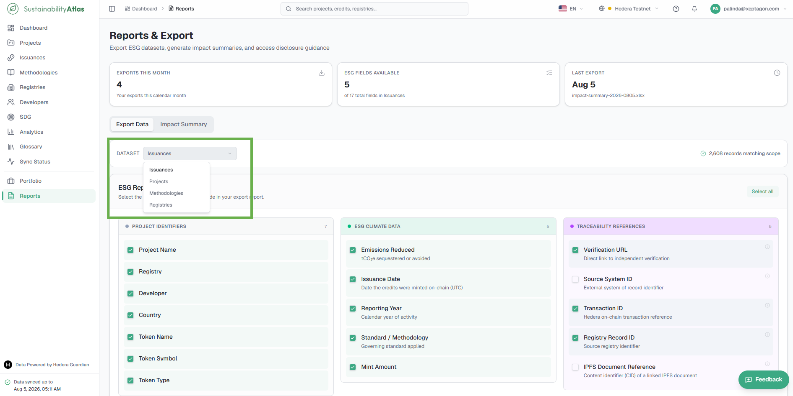
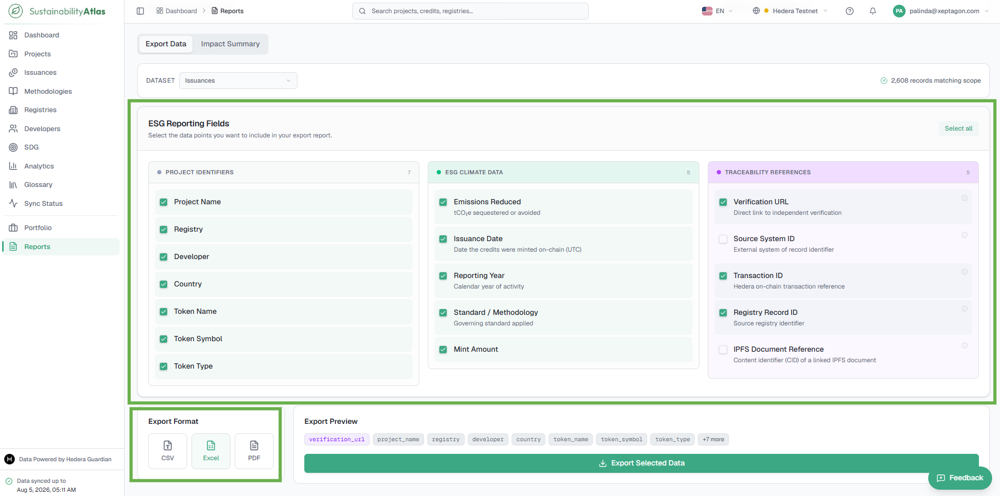
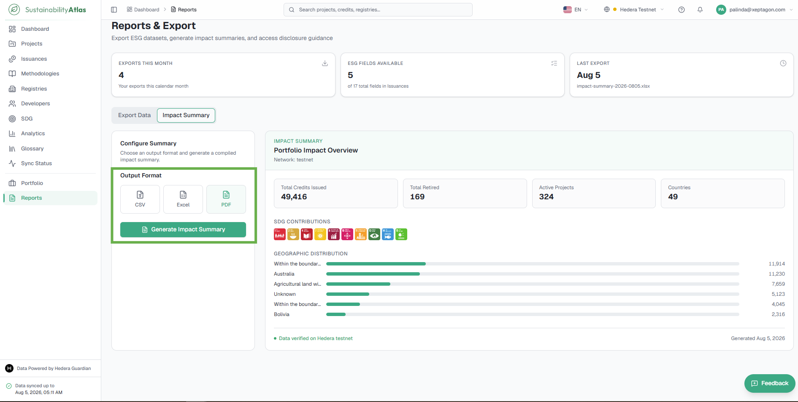

# 10 — Reports and Exports

The Reports module enables users to export data from the Sustainability Atlas in standard reporting formats and generate ESG-focused datasets for analysis. Users can choose which dataset to export, select the reporting fields to include, preview the exported columns and download the results in multiple file formats. It requires a signed-in account.

## Datasets

Before generating an export, users select the dataset they wish to report on. The available datasets depend on the configured Sustainability Atlas modules and may include:

* Projects
* Issuances
* Methodologies
* Registries

Changing the dataset refreshes the available reporting fields.

## ESG reporting fields

Users customize the contents of an export by selecting the reporting fields to include. The fields are grouped into logical categories to simplify selection.

| Category | Description |
| --- | --- |
| Project Identifiers | Basic project and registry information. |
| ESG Climate Data | Climate-related reporting metrics and issuance information. |
| Traceability References | Blockchain and registry identifiers supporting data verification. |

## Impact Summary

The Impact Summary provides a consolidated overview of the sustainability impact represented by the selected dataset. Instead of exporting raw records, this view generates a high-level summary suitable for presentations, executive reporting and ESG disclosures. Users can select the desired output format — CSV, Excel or PDF — before generating the summary.

## Export a Report

Generates a configurable export or an Impact Summary from the Reports page.

### Prerequisites

* A signed-in account. The Reports entry appears in the sidebar only when signed in.

### Steps

1. Open **Reports** from the sidebar.
2. Select the dataset to report on — Projects, Issuances, Methodologies, or Registries. Changing the dataset refreshes the available reporting fields.
3. Select the reporting fields to include. Fields are grouped into categories (Project Identifiers, ESG Climate Data, Traceability References) to simplify selection.
4. Choose the output format: CSV, Excel or PDF.
5. Select **Export Selected Data** to generate the report using the selected format and fields.
   * To generate a high-level Impact Summary instead of raw records, choose the output format under Impact Summary and generate the summary from there.

### Result

The report is generated in the chosen format and downloads to your device, containing only the fields you selected.

## Key distinctions

**Reports vs. Download Data.** Every list page offers a Download Data button that exports the currently filtered table as-is. The Reports module goes further: it lets users choose the dataset, pick individual reporting fields, and export as CSV, Excel or PDF — or generate an Impact Summary rather than raw records. See [Download Project Data](04-projects.md#download-project-data) for the quick per-table CSV data export from list views.

---

### Related & Workflow Progression

* ← **Previous**: [09 — Portfolio](09-portfolio.md) – Personal watchlist management and custom dashboard widgets
* **Step 10 of 15**: **Reports and Exports** – Custom dataset exports and ESG impact summaries
* → **Next**: [11 — Account and Security](11-account-and-security.md) – Profile settings, password changes, API keys, and rate limits
