# 11 — Account and Security

The Account and Security page allows users to manage their personal account information, update their password, view API request limits, manage API keys, review recent account activity, and replay the guided product tour. It requires a signed-in account.

To access this page, select your account menu in the top-right corner of the application and choose **Account Settings**.

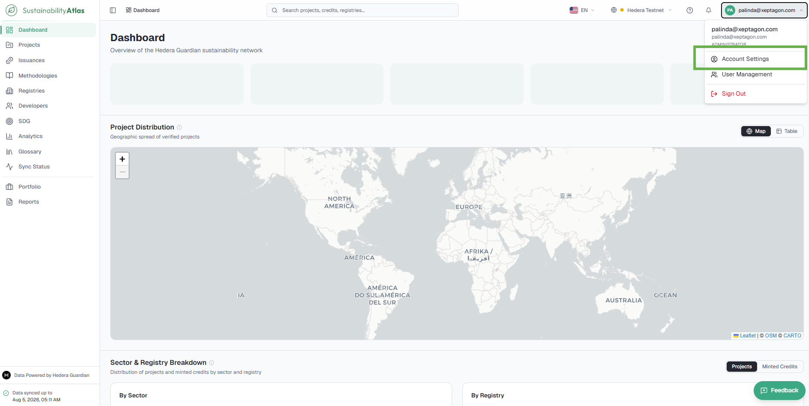

## Profile

The Profile section displays your personal account information and allows you to update your profile details. Select **Edit** to modify the editable fields.

| Field | Description |
| --- | --- |
| First Name | Your given name. |
| Last Name | Your family name. |
| Organization | The organization associated with your account. |
| Job Title | Your current role or position. |
| Country | Your country or region. |
| Email Address | The email address used to sign in. This field is read-only and cannot be changed from this page. |
| Member Since | The date your account was created. This information is read-only. |

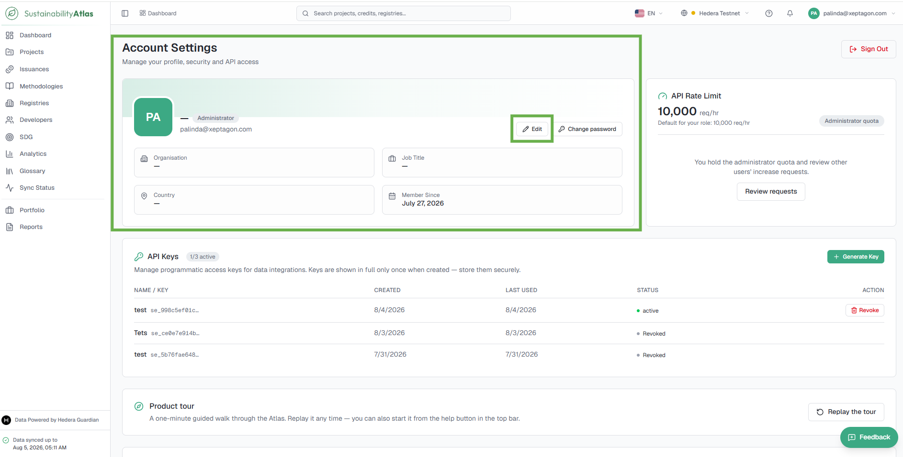

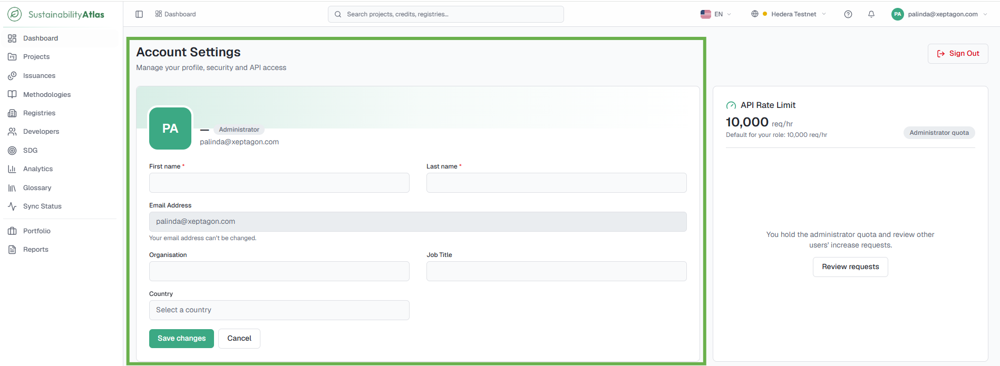

## Change Your Password

Changes the password used to sign in to the Sustainability Atlas, from the Security section of Account Settings. To reset a password you no longer know, use [Reset a forgotten password](01-getting-started.md#reset-a-forgotten-password) instead.

### Prerequisites

* A signed-in account.

### Steps

1. Open **Account Settings** from the account menu and go to the Security section.
2. Select **Change Password**.
3. Enter your current password.
4. Enter a new password.
   * As you type, the system displays the current password requirements and automatically indicates which have been satisfied.
5. Confirm the new password.
6. Submit the form.

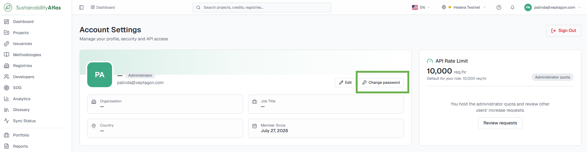

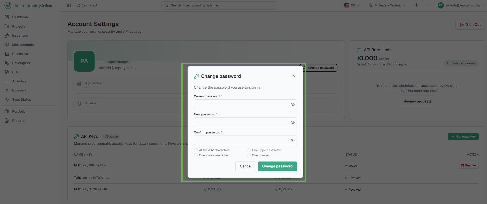

### Result

The password is changed. Use the new password the next time you sign in.

## Request limits

The API Request Limits section displays the number of API requests your account is permitted to make within a given time period. This limit applies only to programmatic access through the API and does not affect normal use of the Sustainability Atlas through the web interface.

The card displays your current request limit and the default request limit assigned to your role.

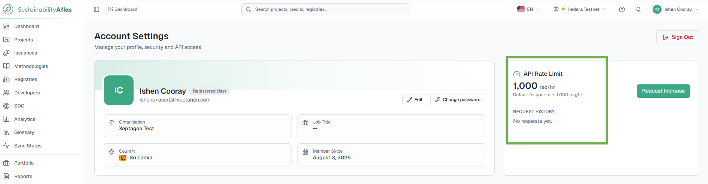

## Request a Higher API Limit

Requests additional API capacity beyond the default limit assigned to your role. The request is reviewed by a system administrator.

### Prerequisites

* A signed-in account.

### Steps

1. Open **Account Settings** from the account menu and locate the API Request Limits card.
2. Select **Request Increase**.
3. In the request form, specify:
   * The requested API limit (up to the maximum allowed).
   * A justification explaining why the additional capacity is required.
4. Submit the request.

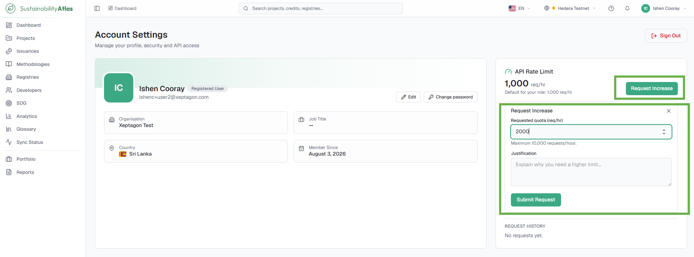

### Result

The request is submitted for administrator review. While awaiting approval, the page displays an **Increase Request Pending** status.

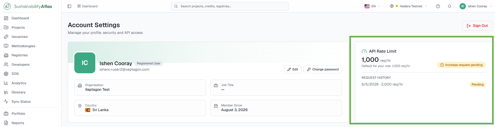

The Request History table records all submitted requests together with their status:

| Status | Description |
| --- | --- |
| Pending | The request is awaiting review. |
| Approved | The requested limit has been approved. |
| Adjusted | The request was approved with a different limit than originally requested. |
| Declined | The request was not approved. |

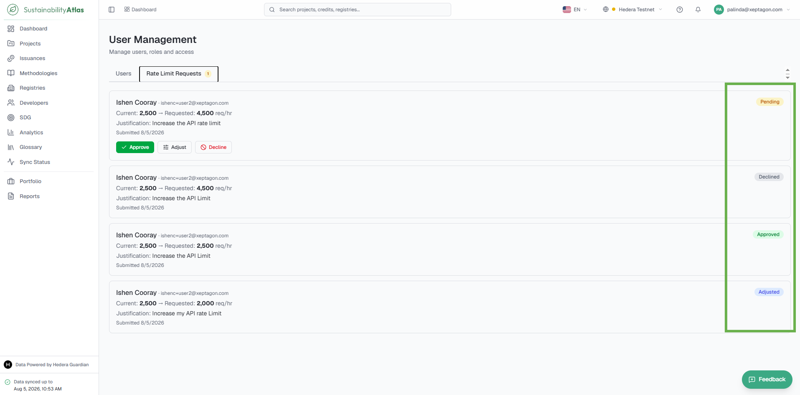

Administrators review these requests from the User Management panel — see [Administration](13-administration.md#reviewing-api-limit-increase-requests).

## API keys

API keys allow external applications, scripts and system integrations to securely access Sustainability Atlas data without requiring an interactive browser session.

### Generating an API key

1. Open **Account Settings** from the account menu and locate the API Keys section.
2. Select **Generate Key**.
3. When prompted, provide a descriptive name for the key (e.g., *Production Integration*, *Development Environment*).
4. After the key has been generated, select **Copy** to save it, and store it securely.
   * The full API key is displayed only once. After the dialog is closed, the key cannot be viewed again. If the key is lost, it must be revoked and replaced with a new one.

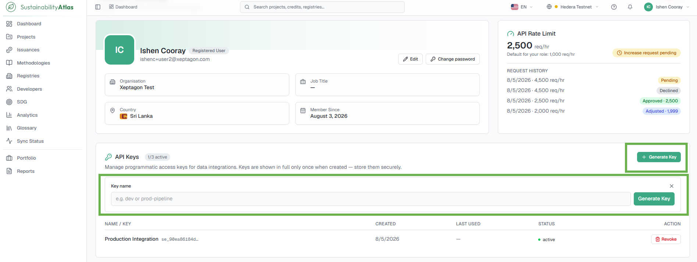

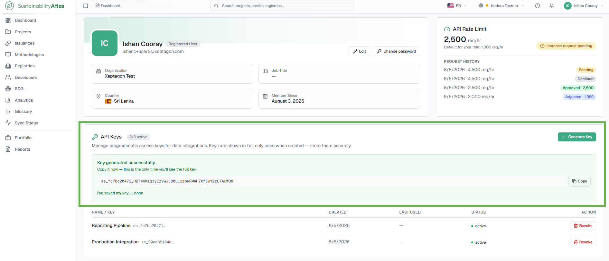

### Managing existing keys

The API Key table displays the key name, key identifier, date created, last used, and current status. Each active key includes a **Revoke** action.

* Revoking an API key immediately disables it and permanently prevents any future use.
* Each account can maintain a limited number of active API keys simultaneously. If the maximum has been reached, new keys cannot be generated until an existing key has been revoked.

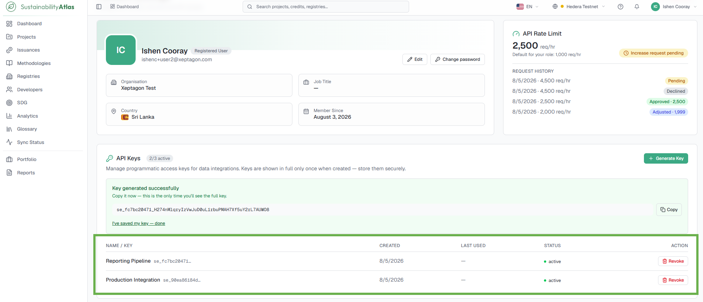

### Result

New keys appear in the API Key table with an active status; revoked keys are disabled immediately.

---

### Related & Workflow Progression

* ← **Previous**: [10 — Reports and Exports](10-reports-and-exports.md) – Custom dataset exports and ESG impact summaries
* **Step 11 of 15**: **Account and Security** – Profile settings, password changes, API keys, and rate limits
* → **Next**: [12 — Sync Status](12-sync-status.md) – Real-time Hedera mirror node synchronization and pipeline health
