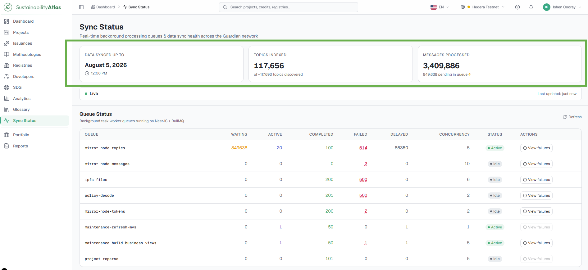
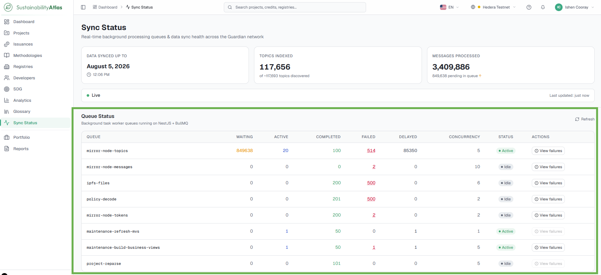
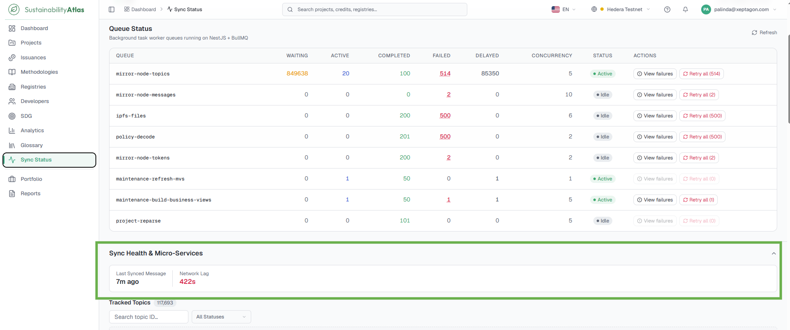
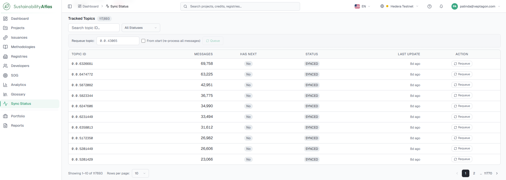
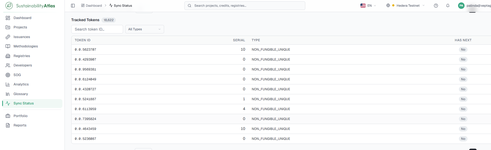
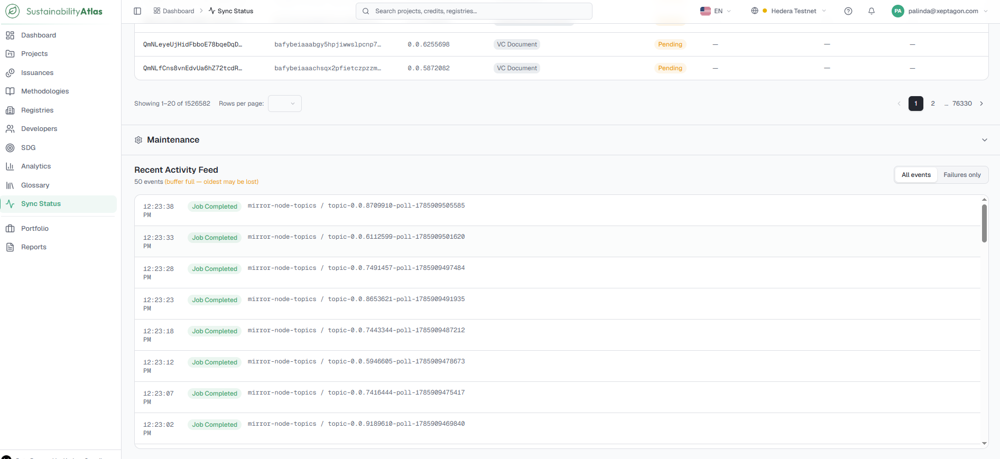

# 12 — Sync Status

The Sync Status page provides real-time visibility into the data synchronization process between the Sustainability Atlas and the Hedera Guardian network. It allows users to verify how current the displayed data is, monitor the health of background processing services, and view the status of indexed topics, tokens and documents.

All users can view the information on this page. Administrative actions such as retrying failed jobs, requeuing topics or pausing queues are available only to administrators — see [Administration](13-administration.md#sync-status-page).

## Understanding synchronization

The Sustainability Atlas does not maintain its own source of truth for carbon market data. Instead, it continuously retrieves published information from the Hedera Guardian network and indexes it for searching, reporting and analytics.

Whenever new projects, methodologies, issuances or other records are published to the network, background synchronization services process those records and make them available within the Atlas. Because synchronization is continuous rather than instantaneous, newly published information may take a short time to appear.

The **Data Synced Up To** timestamp, displayed throughout the application, indicates the most recent point in time that has been successfully processed. If expected information is not yet visible, checking this timestamp is the quickest way to determine whether synchronization is still in progress.

## Synchronization overview

The summary cards at the top of the page provide a high-level overview of synchronization progress.

| Card | Description |
| --- | --- |
| Data Synced Up To | Displays the latest successfully synchronized timestamp. |
| Topics Indexed | Shows the number of Hedera topics currently indexed by the Atlas compared with the total discovered topics. |
| Messages Processed | Displays the total number of processed blockchain messages together with any messages still awaiting processing. |

## Queue status

Synchronization tasks are processed through multiple background queues, each responsible for a different type of processing activity. The Queue Status table provides operational information for every queue.

| Column | What it means |
| --- | --- |
| Queue | Name of the processing queue. |
| Waiting | Number of jobs waiting to be processed. |
| Active | Number of jobs currently being processed. |
| Completed | Total successfully completed jobs. |
| Failed | Jobs that encountered processing errors. |
| Delayed | Jobs scheduled to be retried later. |
| Concurrency | Maximum number of simultaneous jobs allowed. |
| Status | Current queue status (for example, Active or Idle). |

The page also displays whether synchronization updates are being received through live updates or periodic polling, together with the most recent refresh time.

In normal operation, a queue may contain waiting jobs while active workers process them; waiting jobs gradually decrease and completed jobs increase over time. If a queue shows a continually increasing number of failed jobs or remains inactive for an extended period, synchronization for that queue may require administrator attention. Selecting **View Failures** allows users to inspect failed processing records; retry actions are available only to administrators.

## Synchronization health

The Sync Health & Micro-Services section provides a summary of the overall health of the synchronization platform: the last successful synchronization, the current synchronization lag, and the health of background synchronization services.

Synchronization lag represents the delay between the latest information available on the Hedera network and the data currently available within the Sustainability Atlas. A mild synchronization lag is expected during normal operation.

## Tracked topics

The Tracked Topics table lists every Hedera topic currently monitored by the Sustainability Atlas. Users can search by Topic ID or filter the list using the available status filters. This view helps verify that a particular project, registry or methodology topic has been successfully discovered and indexed.

## Tracked tokens

The Tracked Tokens section displays all Hedera tokens currently indexed by the Sustainability Atlas. Users can search for specific tokens or filter the results by token type, to confirm that a specific carbon credit token has been indexed successfully.

## Recent activity

The Recent Activity feed displays a chronological record of synchronization events occurring within the system — queue jobs starting and completing, synchronization failures, retry operations, and background processing activities. The feed can be filtered to display all events or failure events only.

---

### Related & Workflow Progression

* ← **Previous**: [11 — Account and Security](11-account-and-security.md) – Profile settings, password changes, API keys, and rate limits
* **Step 12 of 15**: **Sync Status** – Real-time Hedera mirror node synchronization and pipeline health
* → **Next**: [13 — Administration](13-administration.md) – User management, role quotas, and system maintenance actions
