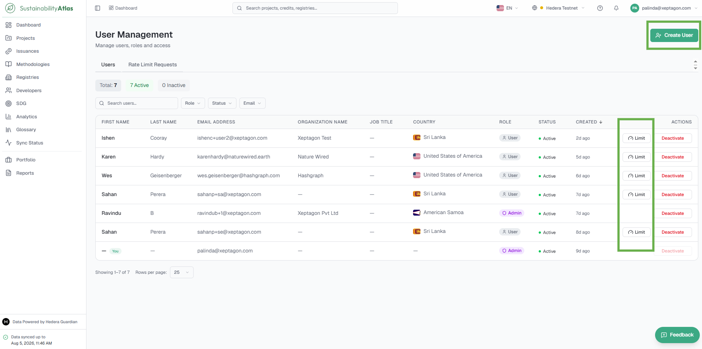
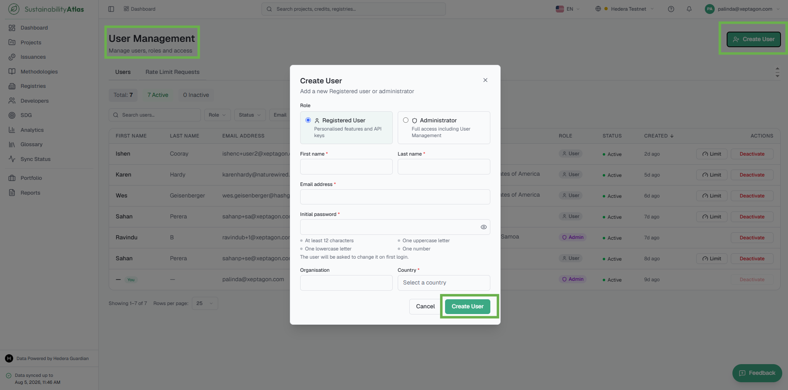
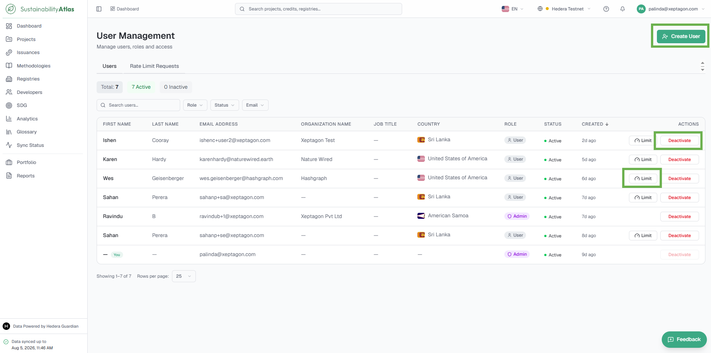
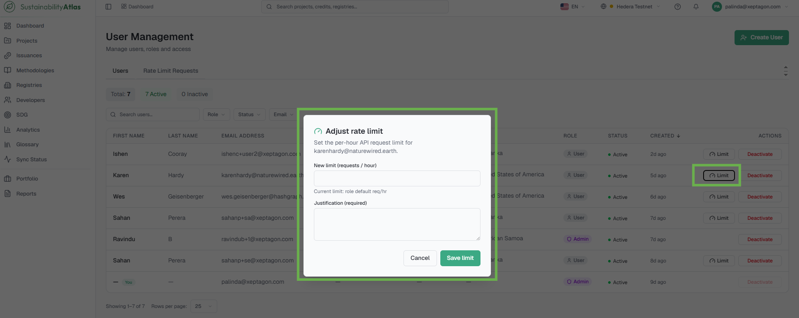
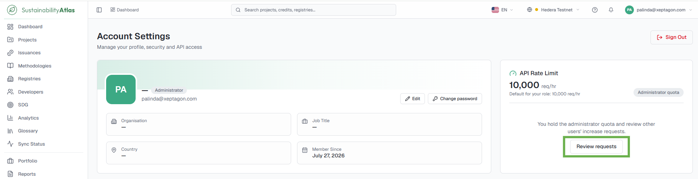
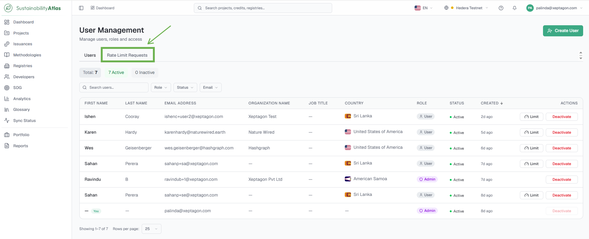
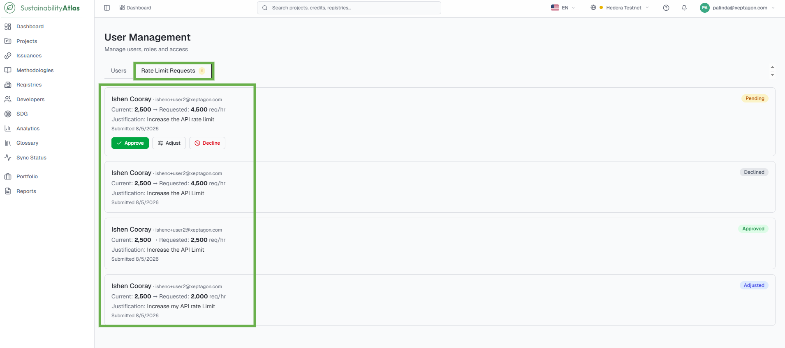

# 13 — Administration

The Administration features provide tools for managing users, reviewing API request limit increases and performing administrative maintenance across the Sustainability Atlas. These features are available only to users with the Administrator role; standard users do not see the administration options described in this section.

## User Management

The User Management page allows administrators to create accounts, manage user access, assign roles and configure API request limits. To access it, select your account menu in the upper-right corner of the application and choose **User Management**.

The page consists of two tabs:

* **Users** – every platform account, with the administrative actions described below.
* **Rate Limit Requests** – API limit increase requests submitted by users, awaiting review.

### Roles

| Role | Description |
| --- | --- |
| User | Standard access with personalized features and API key management. |
| Administrator | Full administrative access, including User Management and system maintenance features. |

## Create a User Account

Creates a new user account from the User Management page. Accounts created this way sign in with a temporary password and must change it on first login.

### Prerequisites

* The Administrator role.

### Steps

1. Open **User Management** from the account menu.
2. Select **Create User**.
3. Provide the required information:
   * First Name
   * Last Name
   * Email Address
   * Organization
   * Job Title
   * Country
   * User Role (User or Administrator)
   * Initial Password
4. Submit the form.
   * All fields are validated before the account is created. Validation includes required fields, email format and password policy.

### Result

The system displays a confirmation message. Upon signing in for the first time, the user is required to change their password before accessing the application.

## Manage User Accounts

Activates or deactivates users, configures per-user API request limits, and reviews API limit increase requests from the User Management page.

### Activating or deactivating a user

1. Open **User Management** from the account menu and locate the user in the **Users** tab.
2. Use the activate or deactivate action on the user's record.
   * Deactivating an account prevents future sign-ins while preserving all historical data associated with the user.
   * Administrators cannot deactivate their own account, preventing accidental loss of administrative access.

### Configuring a user's API request limit

1. On the user's record, open the API request limit action.
2. Provide the new request limit and a justification for the change.
   * The justification is stored as part of the administrative audit history.
3. Save the change.

### Reviewing API limit increase requests

1. Open the **Rate Limit Requests** tab.
2. Review each pending request and approve it, approve it with an adjusted limit, or decline it.

### Result

Deactivated users can no longer sign in; reactivated users regain access. Any approved limit changes take effect immediately for the user's API access, and the requesting user sees the outcome in their Request History.

## Administrative Maintenance Actions

The maintenance actions administrators see on project records, methodology records, and the Sync Status page. Standard users do not see these actions.

### Project records (Advanced tab)

| Action | What it does |
| --- | --- |
| Re-Extract | Processes the project's existing source documents again and rebuilds any derived information. Useful when project metadata appears incomplete or outdated. The system queues the extraction process and displays the number of documents scheduled for processing; if no source documents are available, the system notifies the administrator. |
| Refresh IPFS | Downloads the project's linked IPFS documents again and reprocesses their contents. Use when project documents were unavailable or could not be processed successfully. The system reports how many documents have been queued for retrieval and processing. |

### Methodology records (Decoded Mapping tab)

| Action | What it does |
| --- | --- |
| Re-run Decoder | Processes the methodology again using the policy decoder. Typically used when decoding previously failed or when the methodology policy has changed. |
| Re-Parse Projects | Reprocesses all projects associated with the selected methodology using the current mapping configuration. Available only after the methodology has been successfully decoded. The system reports how many projects have been queued for processing. |
| Edit Mapping | Manually modifies the mapping between decoded project fields and schema fields. Administrators can assign different schema fields, remove mappings, and specify array indexes where required. Every saved modification is recorded in the Manual Mapping History — administrator, modified fields, and date and time. Manual mapping changes remain in effect until the decoder is run again. |

### Sync Status page

| Action | What it does |
| --- | --- |
| Pause Queue | Temporarily prevents synchronization for that processing pipeline, for maintenance purposes. |
| Resume Queue | Resumes a paused queue when processing should continue. |
| View Failed Jobs | Inspects failed jobs and their failure reasons. |
| Retry Failed Jobs | Retries individual failed jobs. Where necessary, retry limits may be overridden after confirming that the underlying issue has been resolved. |
| Retry All Failed Jobs | Retries every failed job in the queue. |
| Requeue Topics | Manually requests that a Hedera topic be synchronized again — either from the current synchronization position or from the beginning of the topic. The topic identifier is validated before the request is submitted. |

---

### Related & Workflow Progression

* ← **Previous**: [12 — Sync Status](12-sync-status.md) – Real-time Hedera mirror node synchronization and pipeline health
* **Step 13 of 15**: **Administration** – User management, role quotas, and system maintenance actions
* → **Next**: [14 — Glossary and Help](14-glossary-and-help.md) – Terminology definitions and platform help guide
