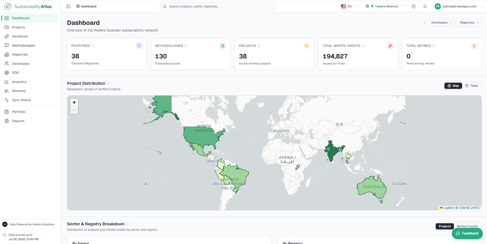

# Sustainability Atlas

The Sustainability Atlas is a read-only explorer for carbon credit data published to the Hedera Guardian network. It gathers what registries, methodologies, projects and issued credits have recorded on chain, and presents it as searchable lists, project records, charts and exports.

## Who the Atlas is for

Anyone who uses the Atlas through a browser: credit buyers checking supply and vintages, project developers tracking their own portfolio, registry staff reviewing what has been published under their policies, analysts building market views, and auditors following a number back to the document it came from.

## Access levels

| Level | What you get |
| --- | --- |
| Guest (not signed in) | Full read-only access to every public page: the dashboard, projects, issuances, methodologies, registries, developers, SDGs, analytics, the glossary and the sync status page. Can filter, sort, compare projects, open any record and download any table as CSV with Download Data. |
| Signed-in user | Everything a guest gets, plus a personal Portfolio with a watchlist and configurable widgets, saved quick filters, the Reports page, watchlist notifications, API keys and a request limit allowance. |
| Administrator | Everything a signed-in user gets, plus User Management, per-user request quotas, and maintenance actions on projects, methodologies and the sync pipeline. |

## Related

### Documentation Master Flow

1. **Introduction** – Platform concept overview and access levels (this page)
2. [Getting Started](01-getting-started.md) – Account onboarding, sign-up, sign-in, and interactive product tour
3. [Navigating the Atlas](02-navigating-the-atlas.md) – Sidebar navigation, search, network selection, and interface controls
4. [Dashboard](03-dashboard.md) – At-a-glance platform metrics and landing overview
5. [Projects](04-projects.md) – Verified sustainability project catalogue and metadata
6. [Issuances and Credits](05-issuances-and-credits.md) – Issued carbon credit tokens, mintings, and serial ranges
7. [Methodologies](06-methodologies.md) – Published policy workflows, rules, and decoding statuses
8. [Registries, Developers and SDGs](07-registries-developers-sdgs.md) – Standard registries, project developers, and SDG alignment
9. [Analytics](08-analytics.md) – Market analytics, cross-cutting trend views, and distributions
10. [Portfolio](09-portfolio.md) – Personal watchlist management and custom dashboard widgets
11. [Reports and Exports](10-reports-and-exports.md) – Custom dataset exports and ESG impact summaries
12. [Account and Security](11-account-and-security.md) – Profile settings, password changes, API keys, and rate limits
13. [Sync Status](12-sync-status.md) – Real-time Hedera mirror node synchronization and pipeline health
14. [Administration](13-administration.md) – User management, role quotas, and system maintenance actions
15. [Glossary and Help](14-glossary-and-help.md) – Terminology definitions and platform help guide
16. [FAQ and Troubleshooting](15-faq-and-troubleshooting.md) – Answers to common questions and troubleshooting guide
